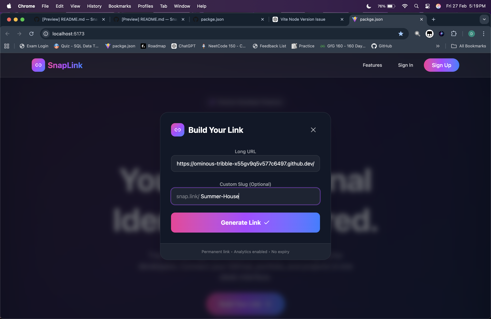
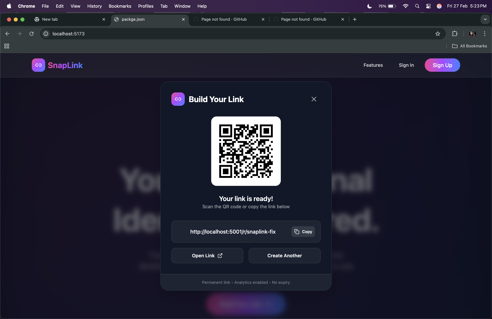

# 🔗 SnapLink — Smart Link Shortener + Analytics

A modern, fast, and clean URL shortener that lets users create short links, manage them, and track performance with a sleek UI.  
Built to feel like a real product, not a college assignment pretending to be one.

---

## ✨ Highlights

- ✅ Shorten long URLs into clean shareable links
- ✅ Custom aliases (optional)
- ✅ Click tracking + basic analytics
- ✅ Copy-to-clipboard + QR-friendly links
- ✅ Responsive UI (mobile + desktop)
- ✅ Built with production-style structure (CI/CD branch support)

---

## 🖼️ Screenshots

> Put your screenshots inside `./screenshots/` and update the file names below.

### Landing / Home


### Create Link Flow


### Dashboard / Analytics


### Shareable output


---

## 🧠 How It Works (Simple Explanation)

1. User submits a long URL  
2. Backend generates a unique short code (or uses custom alias)  
3. Short link redirects instantly to the original URL  
4. Each redirect increments click metrics (and can store metadata like timestamp/device later)

---

## 🧩 Tech Stack

**Frontend**
- React + TypeScript
- TailwindCSS (or your UI styling approach)
- Axios / Fetch for API calls

**Backend**
- Node.js + Express
- Database: MongoDB (or whatever you used)
- REST API architecture

**DevOps (Optional / In-progress)**
- CI/CD integration branch setup
- GitHub workflows (if configured)

---

## 📦 Features (Detailed)

### 🔹 Link Shortening
- Converts long URLs into short links
- Validates URL input to avoid broken redirects

### 🔹 Link Management
- View previously created links
- Copy, share, and reuse easily

### 🔹 Click Analytics
- Tracks total clicks per link
- Dashboard view for quick insights

### 🔹 Clean UX
- Minimal UI noise
- Smooth interactions and quick feedback

---

## 🚀 Getting Started

### 1) Clone the Repository
```bash
git clone https://github.com/<your-username>/SnapLink.git
cd SnapLink
